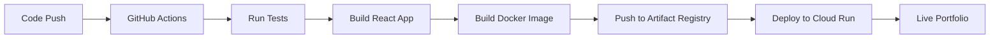

# Jack Wang - Portfolio Website

A modern, responsive portfolio website built with React and Material-UI, showcasing my skills as a software engineer. This project demonstrates professional development practices with a complete DevOps pipeline.


## 🚀 Live Demo
- **Production**: [Your deployed URL here]
- **Development**: `npm start` → [http://localhost:3000](http://localhost:3000)

## 🛠️ Tech Stack
- **Frontend**: React 18, Material-UI, SCSS
- **Build**: Create React App, Webpack
- **Testing**: Jest, React Testing Library
- **Containerization**: Docker, Nginx
- **CI/CD**: GitHub Actions
- **Cloud**: Google Cloud Platform (Artifact Registry)
- **Infrastructure**: Kubernetes (optional)

## 🔧 DevOps Pipeline Overview

This portfolio demonstrates enterprise-level DevOps practices with automated testing, building, and deployment. Here's what each tool does for this specific project:

### 🤖 GitHub Actions (CI/CD)
**Files**: `.github/workflows/simple-ci.yml`, `.github/workflows/ci.yml`

**What it does for this portfolio**:
- **Automated Testing**: Runs React tests on every code push to catch bugs early
- **Build Validation**: Ensures the portfolio builds successfully before deployment
- **Docker Testing**: Verifies the containerized version works correctly
- **Security Scanning**: Checks for vulnerabilities in npm packages
- **Auto-Deployment**: Pushes successful builds to Google Cloud Artifact Registry
- **Quality Gates**: Prevents broken code from reaching production

**Triggers**: Every push to `main` branch and pull requests

### 🐳 Docker (Containerization)
**Files**: `Dockerfile`, `compose.yaml`

**What it does for this portfolio**:
- **Consistent Environment**: Portfolio runs identically on any machine/server
- **Production Optimization**: Uses Nginx to serve static React files efficiently
- **Easy Deployment**: Single container contains everything needed to run the site
- **Scalability**: Can easily spin up multiple instances for high traffic
- **Isolation**: Portfolio runs in its own contained environment

**Container Stack**: React Build → Nginx → Port 80

### 📦 Google Cloud Artifact Registry
**Configuration**: In GitHub Actions workflow

**What it does for this portfolio**:
- **Image Storage**: Stores Docker images of your portfolio securely
- **Version Control**: Keeps track of different versions (by commit SHA + latest)
- **Global Access**: Images available from any Google Cloud region
- **Integration**: Works seamlessly with Google Cloud Run, Kubernetes, etc.
- **Security**: Private registry with access controls

**Image Location**: `australia-southeast1-docker.pkg.dev/PROJECT_ID/portfolio-docker-repo/portfolio`

### ⚙️ Makefile (Development Automation)
**File**: `Makefile`

**What it does for this portfolio**:
- **Simplified Commands**: `make dev` instead of long docker-compose commands
- **Development Workflow**: Quick start, stop, rebuild, and cleanup commands
- **Docker Management**: Easy container building and testing
- **Consistency**: Same commands work for all developers
- **Documentation**: Self-documenting with `make help`

**Common Commands**: `make dev`, `make build`, `make clean`, `make logs`

### 🧪 Testing Framework
**Files**: `src/App.test.js`, `src/setupTests.js`

**What it does for this portfolio**:
- **Component Testing**: Verifies React components render correctly
- **Regression Prevention**: Catches when changes break existing functionality
- **CI Integration**: Automated testing in GitHub Actions pipeline
- **Code Quality**: Ensures portfolio meets quality standards
- **Confidence**: Safe to deploy when all tests pass

**Test Coverage**: Component rendering, user interactions, navigation

### 🎨 Code Quality Tools
**Configuration**: ESLint in `package.json`

**What it does for this portfolio**:
- **Code Standards**: Enforces consistent React/JavaScript coding style
- **Bug Prevention**: Catches common programming errors before runtime
- **Best Practices**: Ensures modern React patterns (hooks, etc.)
- **Team Consistency**: Same code style across all contributors
- **CI Enforcement**: Blocks deployment if code quality issues exist

### 🚀 Deployment Options

#### Option 1: Google Cloud Run (Recommended)
```bash
# Deploy directly from Artifact Registry
gcloud run deploy portfolio \
  --image australia-southeast1-docker.pkg.dev/PROJECT_ID/portfolio-docker-repo/portfolio:latest \
  --platform managed \
  --region australia-southeast1
```

#### Option 2: Kubernetes (Advanced)
**Files**: `k8s/` directory
- **Scalability**: Auto-scaling based on traffic
- **High Availability**: Multiple replicas across nodes
- **Rolling Updates**: Zero-downtime deployments
- **Health Checks**: Automatic restart if portfolio becomes unhealthy

#### Option 3: GitHub Pages (Simple)
- **Free Hosting**: Automatic deployment from GitHub
- **Custom Domain**: Support for custom domains
- **HTTPS**: Built-in SSL certificates
- **CDN**: Global content delivery network

## 🔄 Complete Workflow



1. **Developer pushes code** to GitHub
2. **GitHub Actions triggers** automatically
3. **Tests run** to ensure quality
4. **React app builds** for production
5. **Docker image creates** with Nginx
6. **Image pushes** to Google Cloud
7. **Deployment happens** automatically
8. **Portfolio goes live** with new changes

## 📊 Benefits of This Setup

### For Development
- ✅ **Fast feedback**: Know immediately if changes break anything
- ✅ **Consistent environment**: Same setup for all developers
- ✅ **Easy commands**: Simple `make` commands for common tasks
- ✅ **Quality assurance**: Automated code quality checks

### For Production
- ✅ **Zero downtime**: Rolling deployments without service interruption
- ✅ **Scalability**: Handle traffic spikes automatically
- ✅ **Reliability**: Self-healing infrastructure
- ✅ **Security**: Automated vulnerability scanning
- ✅ **Monitoring**: Built-in logging and metrics

### For Portfolio Showcase
- ✅ **Professional practices**: Demonstrates enterprise-level DevOps skills
- ✅ **Modern stack**: Uses current industry-standard tools
- ✅ **Automation**: Shows understanding of CI/CD pipelines
- ✅ **Cloud native**: Experience with containerization and cloud platforms

## 🚀 Quick Start

### Option 1: Local Development (Recommended for coding)
```bash
# Clone and start development
git clone [your-repo-url]
cd portfolio
npm install          # Install dependencies locally
npm start           # Start React dev server with hot reload
# Opens http://localhost:3000 with instant code updates
```

### Option 2: Docker Development (Test production environment)
```bash
# Clone and test production build
git clone [your-repo-url]
cd portfolio
make build          # Builds Docker image (includes npm install inside container)
make up            # Runs containerized version
# Opens http://localhost:3000 served by Nginx
```

### Option 3: Production Deployment
```bash
# Automatic via GitHub Actions (recommended)
git push origin main

# Manual deployment
make docker-build
make docker-run
```

## 🤔 **Development vs Production: Why Both?**

### **Local Development** (`npm install` + `npm start`)
- ✅ **Fast**: Instant code changes with hot reload
- ✅ **Debugging**: React DevTools, source maps, error overlay
- ✅ **Efficient**: Only rebuilds changed files
- ❌ **Different from production**: Uses React dev server, not Nginx

### **Docker Development** (`docker build` + `docker run`)
- ✅ **Production-like**: Same environment as deployed version
- ✅ **Testing**: Verify production build works correctly
- ✅ **Consistency**: Identical to what users see
- ❌ **Slower**: Full rebuild for each change, no hot reload

### **When to Use Each**

| Task | Use | Why |
|------|-----|-----|
| **Daily coding** | `npm start` | Fast iteration, hot reload |
| **Testing builds** | `docker build` | Verify production works |
| **Final testing** | `make up` | Test complete deployment |
| **Production** | GitHub Actions | Automated, reliable deployment |

## Available Scripts

In the project directory, you can run:

### `npm start`

Runs the app in the development mode.\
Open [http://localhost:3000](http://localhost:3000) to view it in your browser.

The page will reload when you make changes.\
You may also see any lint errors in the console.

### `npm test`

Launches the test runner in the interactive watch mode.\
See the section about [running tests](https://facebook.github.io/create-react-app/docs/running-tests) for more information.

### `npm run build`

Builds the app for production to the `build` folder.\
It correctly bundles React in production mode and optimizes the build for the best performance.

The build is minified and the filenames include the hashes.\
Your app is ready to be deployed!

See the section about [deployment](https://facebook.github.io/create-react-app/docs/deployment) for more information.

### `npm run eject`

**Note: this is a one-way operation. Once you `eject`, you can't go back!**

If you aren't satisfied with the build tool and configuration choices, you can `eject` at any time. This command will remove the single build dependency from your project.

Instead, it will copy all the configuration files and the transitive dependencies (webpack, Babel, ESLint, etc) right into your project so you have full control over them. All of the commands except `eject` will still work, but they will point to the copied scripts so you can tweak them. At this point you're on your own.

You don't have to ever use `eject`. The curated feature set is suitable for small and middle deployments, and you shouldn't feel obligated to use this feature. However we understand that this tool wouldn't be useful if you couldn't customize it when you are ready for it.

## Learn More

You can learn more in the [Create React App documentation](https://facebook.github.io/create-react-app/docs/getting-started).

To learn React, check out the [React documentation](https://reactjs.org/).

### Code Splitting

This section has moved here: [https://facebook.github.io/create-react-app/docs/code-splitting](https://facebook.github.io/create-react-app/docs/code-splitting)

### Analyzing the Bundle Size

This section has moved here: [https://facebook.github.io/create-react-app/docs/analyzing-the-bundle-size](https://facebook.github.io/create-react-app/docs/analyzing-the-bundle-size)

### Making a Progressive Web App

This section has moved here: [https://facebook.github.io/create-react-app/docs/making-a-progressive-web-app](https://facebook.github.io/create-react-app/docs/making-a-progressive-web-app)

### Advanced Configuration

This section has moved here: [https://facebook.github.io/create-react-app/docs/advanced-configuration](https://facebook.github.io/create-react-app/docs/advanced-configuration)

### Deployment

This section has moved here: [https://facebook.github.io/create-react-app/docs/deployment](https://facebook.github.io/create-react-app/docs/deployment)

### `npm run build` fails to minify

This section has moved here: [https://facebook.github.io/create-react-app/docs/troubleshooting#npm-run-build-fails-to-minify](https://facebook.github.io/create-react-app/docs/troubleshooting#npm-run-build-fails-to-minify)
