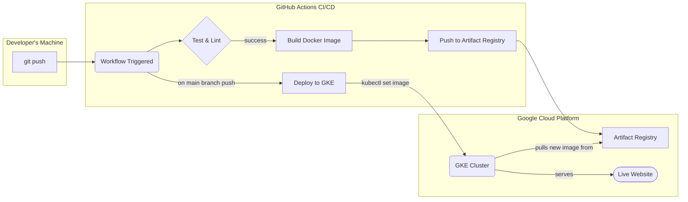

# Cloud-Native Portfolio with Automated CI/CD

This isn't just a portfolio website; it's a demonstration of a complete, automated DevOps workflow. The React application serves as the payload for an enterprise-grade delivery system built on Google Cloud Platform, Kubernetes, and Infrastructure as Code.

[](https://github.com/j-j0/portfolio/actions)

## 🚀 Live Demo

The project is deployed live to a public IP address on Google Cloud:

- **Live Site**: [http://34.54.179.243](http://34.54.179.243)  

## 🏛️ Architecture Overview

The entire lifecycle of this application, from a code commit to a live deployment, is fully automated.



## 🛠️ Tech Stack & Core Components

This project is built on a foundation of modern, cloud-native technologies.

| Category | Technology | Role in Project |
| :--- | :--- | :--- |
| **DevOps & Cloud** | **Terraform** | **Infrastructure as Code (IaC)** for provisioning the GKE cluster. |
| | **Kubernetes (GKE)** | **Orchestration** of the running application for scalability and zero-downtime updates. |
| | **Docker** | **Containerization** of the React/Nginx application for environment consistency. |
| | **GitHub Actions** | **CI/CD** for automating the entire build, push, and deploy pipeline. |
| | **Google Cloud** | The **Cloud Platform** hosting the infrastructure (GKE, Artifact Registry, Load Balancer). |
| | **Nginx** | A lightweight **Web Server** inside the Docker container to serve the static React app. |
| **Frontend** | **React** | The UI framework for building the portfolio website itself. |
| | **Material-UI** | Component library for a clean and modern design. |

---

## 🔧 How It Works: The Automated Pipeline

The core of this project is the CI/CD pipeline defined in `.github/workflows/ci.yml`.

1.  **Code Push**: A developer pushes a commit to the `main` branch.
2.  **CI Trigger**: GitHub Actions automatically triggers the `Test & Build` job. It installs dependencies, runs tests, and ensures the code is of high quality.
3.  **Docker Build & Push**: If CI passes, the `Push to Google Cloud` job begins.
    *   It securely authenticates to GCP using Workload Identity Federation (no long-lived keys).
    *   It builds a production-optimized Docker image using a multi-stage `Dockerfile`.
    *   It tags the image with the unique Git commit SHA and pushes it to a private **Google Artifact Registry**.
4.  **Live Deployment**: Simultaneously, the `Deploy to GKE` job starts.
    *   It connects to the **Kubernetes (GKE) cluster** provisioned by Terraform.
    *   It runs a `kubectl set image` command, telling the running `Deployment` to use the new image identified by the commit SHA.
5.  **Rolling Update**: Kubernetes performs a zero-downtime rolling update, gracefully replacing the old application pods with the new ones. The change is now live.

## ⚙️ Infrastructure as Code (IaC)

The entire cloud infrastructure for this project is managed declaratively using **Terraform**.

**Files:** `/terraform` directory.

-   **`main.tf`**: Defines the Google Kubernetes Engine (GKE) cluster, specifying its location, node count, and machine type.
-   **`providers.tf`**: Configures the Google Cloud provider.
-   **Reproducibility**: The cluster can be destroyed and recreated identically in minutes by running `terraform apply`. This eliminates manual configuration errors and ensures consistency.

## 🚢 Kubernetes Manifests

The state of the application running inside the cluster is defined by three YAML manifests.

**Files:** `/` directory (or `/k8s`).

-   **`deployment.yaml`**: Instructs Kubernetes to run a specified number of replicas of our application's Docker container. It's the blueprint for our app.
-   **`service.yaml`**: Provides a stable internal network endpoint to access the application pods, even as they are created and destroyed.
-   **`ingress.yaml`**: Creates a public-facing Google Cloud Load Balancer and connects it to the service, exposing the application to the internet.

## 🚀 Getting Started Locally

While the primary goal is automated deployment, you can still run and test the application locally.

### Option 1: Docker (Recommended for testing production build)

This method tests the final containerized product exactly as it runs in the cloud.

```bash
# Build the Docker image
docker build -t portfolio .

# Run the container and map port 80 to local port 3000
docker run -p 3000:80 portfolio
```
Now open [http://localhost:3000](http://localhost:3000) in your browser.

### Option 2: Local Development (For making code changes)

This method uses the standard React development server for features like hot-reloading.

```bash
# Install dependencies
npm install

# Start the dev server
npm start
```
This will open [http://localhost:3000](http://localhost:3000) with instant updates as you edit the code.